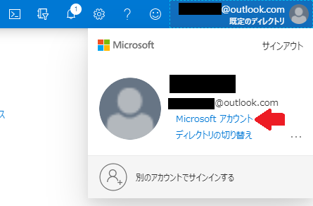
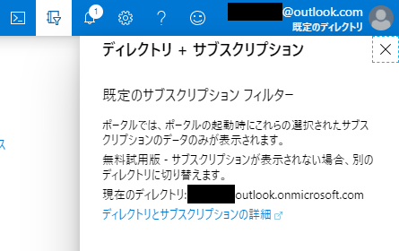
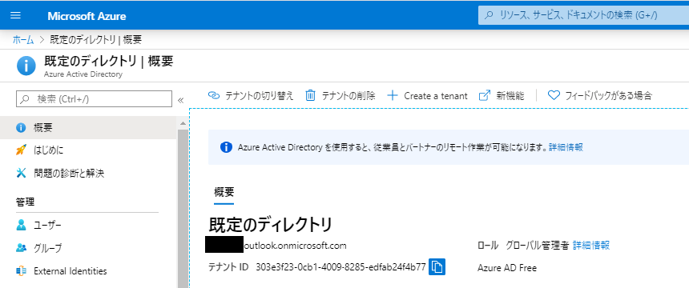

# Azure アカウントの考え方
Microsoft Azure を利用する場合、Microsoftアカウントまたは組織アカウント(Azure Active Directory(AD)で管理されるアカウント)を準備して、そのアカウントで Azure サブスクリプションを契約します。

Microsoft Azure アカウントにおける重要な構成要素
- ユーザアカウント
  * Microsoft アカウント(MSA) / 組織アカウント
  * この 2 つのアカウントの違いは、[2.2.MSAと組織アカウントの違いを理解すべし, Azureの契約直前・直後に意識しておくこと10箇条](https://www.slideshare.net/YuiAshikaga/azure10/14)が分かりやすい
    + Microsoft アカウントで Azure を利用する場合、セキュリティポリシーを強制できないなどの制約があるみたい
- Azure サブスクリプション
  * リソースと割り当てられた所有者をグループ化したもの (Refer to [AWS プロフェッショナルのための Azure](https://docs.microsoft.com/ja-jp/azure/architecture/aws-professional/#accounts-and-subscriptions))
  * AWS における「AWS アカウント」をイメージするとよい
- Azure Active Directory(AD)
  * ユーザアカウントが所属するディレクトリサービス
    + Azure AD におけるディレクトリそれぞれは、テナント(tenant) と呼ばれる
    + Microsoftアカウントで Azure サブスクリプションを契約すると、自動的にテナントが作成される
  * Azure サブスクリプションにおけるロールベースのアクセス制御(RBAC)は、Azure AD で実現する
    + AWS と違い、サブスクリプション(AWSアカウント)からユーザ管理が独立しているとイメージするとよい

IAMユーザとリソースがAWSアカウントに紐づくAWSと違って、Azureではサブスクリプションにリソースが紐づきます。
そしてAzureADに登録されているアカウントにサブスクリプションを紐づけることになります。
AWS の場合、ユーザ管理・リソース管理どちらも AWS アカウントに集約されていますが、
Azure ではユーザ管理: Azure AD, リソース管理: Azure サブスクリプションと独立しているとイメージすればよさそうです。

## Azure Free Account
[Microsoft Learn: Azure アカウントを作成する](https://docs.microsoft.com/ja-jp/learn/modules/create-an-azure-account/) に従って、無料枠のある Azure サブスクリプションを作ってみました。

まず [Azure Portal](https://portal.azure.com/) にログインしてみると、トップメニュー画面右上からユーザアカウント: Microsoftアカウントであることが分かります（下図）。

同じくトップメニュー画面右上の「ディレクトリ+サブスクリプション」アイコンをクリックすると、MSA に基づくディレクトリが作成されていることが分かります（下図）。

Azure サービス: Azure Active Directory を選択すると、このディレクトリのテナント ID を確認できます（下図）。

## 疑問点
- エンタープライズ契約(EA契約)配下の組織アカウントで、EA契約に関係ない「従量課金」の Azure サブスクリプションを契約できるのか
  * [Azureの契約直前・直後に意識しておくこと10箇条](https://www.slideshare.net/YuiAshikaga/azure10/22) をふまえると、https://account.azure.com/organization/ から作成できる気がする

# Links
- [Azure Architecture Center: AWS プロフェッショナルのための Azure](https://docs.microsoft.com/ja-jp/azure/architecture/aws-professional/#accounts-and-subscriptions) (2020年5月確認)
  * アカウントとサブスクリプション, 概要
- [Microsoft Learn: モジュール: Azure アカウントを作成する](https://docs.microsoft.com/ja-jp/learn/modules/create-an-azure-account/)
  * [Learning Path: Azureの基礎](https://docs.microsoft.com/ja-jp/learn/paths/azure-fundamentals/)に含まれるモジュールの一つ
- [Qiita: AzureサブスクリプションとかアカウントとかAzure ADのテナントとか (1)](https://qiita.com/whata/items/628e3a80e5a5c8fe7da9) (2019年9月更新)
  * Azure Active Directory(AD) テナント - アカウント - Azureサブスクリプションの関係性が分かりやすい
- [Qiita: AzureサブスクリプションとかアカウントとかAzure ADのテナントとか (2)](https://qiita.com/whata/items/63a94883912ceaf16d33) (2019年9月更新)
  * エンタープライズ契約(EA契約)に関連する話題
- [Slideshare: Azureの契約直前・直後に意識しておくこと10箇条](https://www.slideshare.net/YuiAshikaga/azure10) (2018年6月30日時点)
  * 1.Azureの契約を今一度確認すべし
  * 2.MSAと組織アカウントの違いを理解すべし
  * 3.Azure ADは最初に作っておくべし
  * 10.サポートは必ず契約しておくべし
